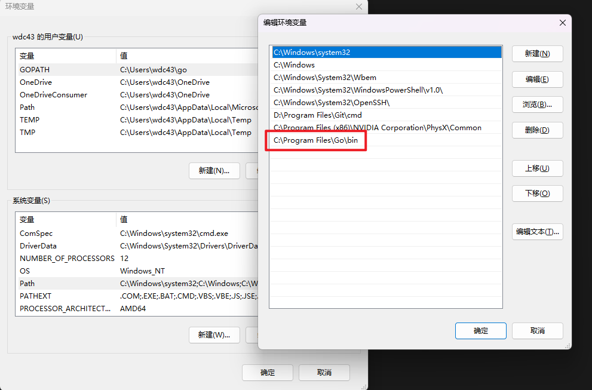
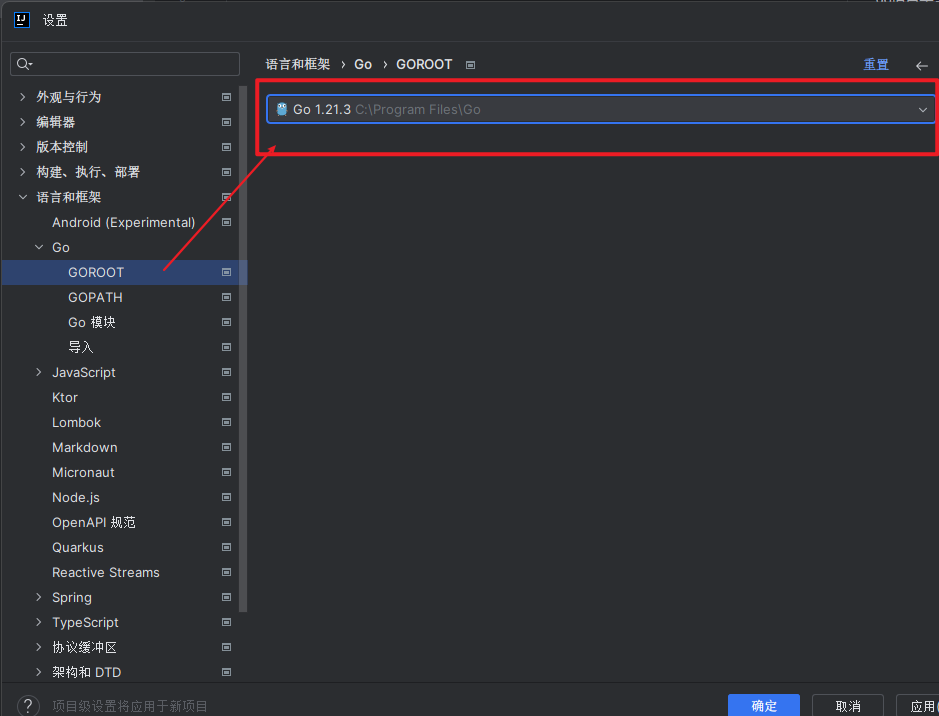
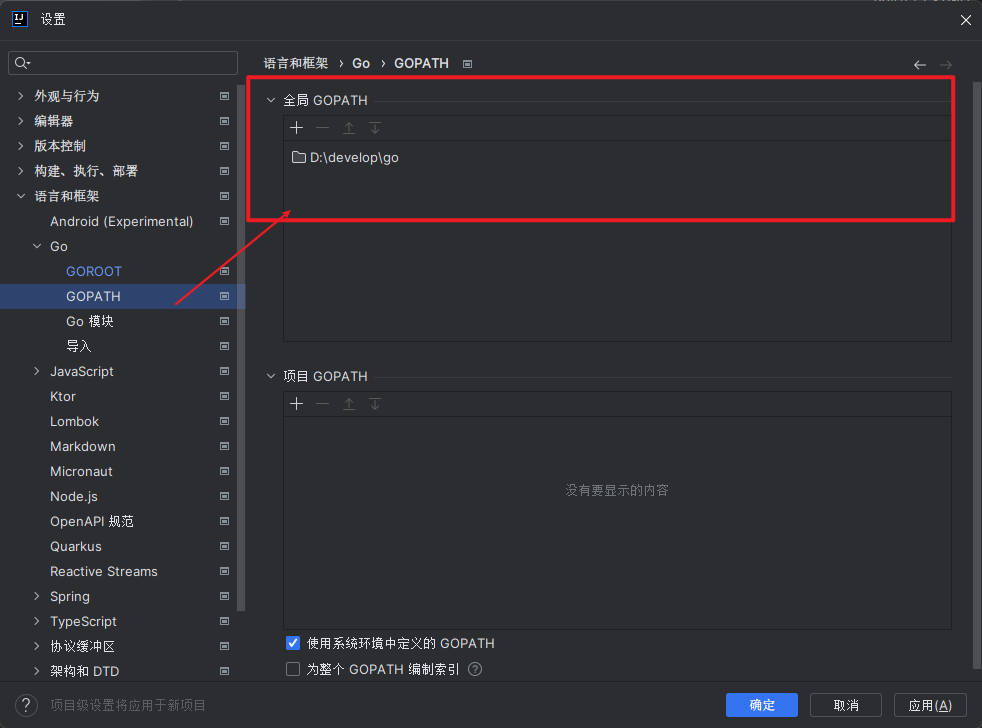

# go-quick
go语言学习仓库


### 环境配置
在官网进行对应系统安装 https://golang.google.cn/

a、windows安装好进行变量配置


b、在cmd中配置具体变量 `go env`
```
#开启mod模式（项目管理需要用到）
go env -w GO111MODULE=on
#重新设置成七牛镜像源（推荐）或阿里镜像源（用原有的会比较慢）
go env -w GOPROXY=https://goproxy.cn,direct
go env -w GOPROXY=https://mirrors.aliyun.com/goproxy
# go 的依赖包存放位置
go env -w GOPATH=xxxxxx

#关闭包的MD5校验
go env -w GOSUMDB=off

#查看环境变量
go env

```

c、idea进行全局配置



### mod使用
1、初始化
`go mod init <module-name>`

2、手动添加依赖项，也可以使用go get命令自动添加依赖项
`go get -u github.com/gin-gonic/gin`

手动添加后使用`go get`命令自动添加依赖项

3、 其他

`go get -u` 升级依赖项

`go list -m all`  列出当前项目的所有依赖项

`go list -m -json all`  列出所有被间接依赖的依赖项

`go mod tidy` 删除不再使用的依赖项

`go mod download`  下载依赖项到本地缓存中。

`go mod vendor`  将项目依赖项复制到vendor目录下，以便将来可以离线构建。

`go mod verify`  验证依赖项的下载是否完整和正确。

`go mod graph`  以图形形式显示当前项目的依赖关系。
